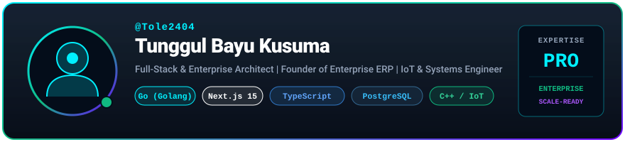

<!-- ================= 1. AURORA CYBER HUD HEADER ================= -->

  

<!-- ================= 2. TYPING SUBTITLE & BADGES ================= -->

  
  
  

---

<!-- ================= 3. ANIMATED CYBER LASER SCANNER ================= -->
### 📟 Biometric Profile & Telemetry Scan

  

---

<!-- ================= 4. FEATURED ENTERPRISE PROJECTS ================= -->
### 🚀 Flagship & Featured Projects

<table>
  <tr>
    <td width="50%" valign="top">
      <h3 align="center">🏢 Enterprise Multi-Tenant ERP</h3>
      

        
      

      
Platform <b>Enterprise Resource Planning (ERP)</b> dengan Clean Architecture di backend Go &amp; frontend Next.js 15. Dilengkapi Auth RBAC, Manajemen Finansial, HR, Inventory, dan Audit Log real-time.

      

        <a href="https://github.com/Tole2404/enterprise"><b>👉 View Repository</b></a>
      

    </td>
    <td width="50%" valign="top">
      <h3 align="center">💼 Aplikasi Penjualan Web</h3>
      

        
      

      
Sistem informasi penjualan dan point of sales berbasis web dengan manajemen produk, transaksi real-time, pencatatan kasir, dan laporan penjualan otomatis.

      

        <a href="https://github.com/Tole2404/Aplikasi-Penjualan-berbasis-Web"><b>👉 View Repository</b></a>
      

    </td>
  </tr>
  <tr>
    <td width="50%" valign="top">
      <h3 align="center">🛍️ EponStore (E-Commerce)</h3>
      

        
      

      
Aplikasi toko online produk Apple dengan arsitektur Java berorientasi objek yang modular, manajemen katalog, dan integrasi database relational.

      

        <a href="https://github.com/Tole2404/EponStore"><b>👉 View Repository</b></a>
      

    </td>
    <td width="50%" valign="top">
      <h3 align="center">🌐 Interactive Portfolio</h3>
      

        
      

      
Website portofolio personal interaktif untuk memamerkan proyek, skill set, dan perjalanan rekayasa perangkat lunak.

      

        <a href="https://portfolio-tunggul.vercel.app/" target="_blank"><b>👉 Live Demo</b></a>
      

    </td>
  </tr>
</table>

---

<!-- ================= 5. TECH STACK ARSENAL ================= -->
### 🛠️ Technical Arsenal & Weaponry

| Domain | Technologies &amp; Frameworks |
| :--- | :--- |
| **PHP Ecosystem** |  |
| **Full-Stack &amp; Modern Web** |  |
| **Backend &amp; Languages** |  |
| **Databases &amp; Cache** |  |
| **DevOps &amp; Engineering Tools** |  |

---

<!-- ================= 6. GITHUB STATS & ANALYTICS ================= -->
### 📊 Telemetry & Contribution Analytics

  <table border="0">
    <tr>
      <td>
        
      </td>
      <td>
        
      </td>
    </tr>
  </table>
  
  

---

<!-- ================= 7. TRANSMISSION / CONTACT ================= -->
### 📡 Transmission Channels

  
  
  

<!-- ================= 8. FOOTER ================= -->

  

